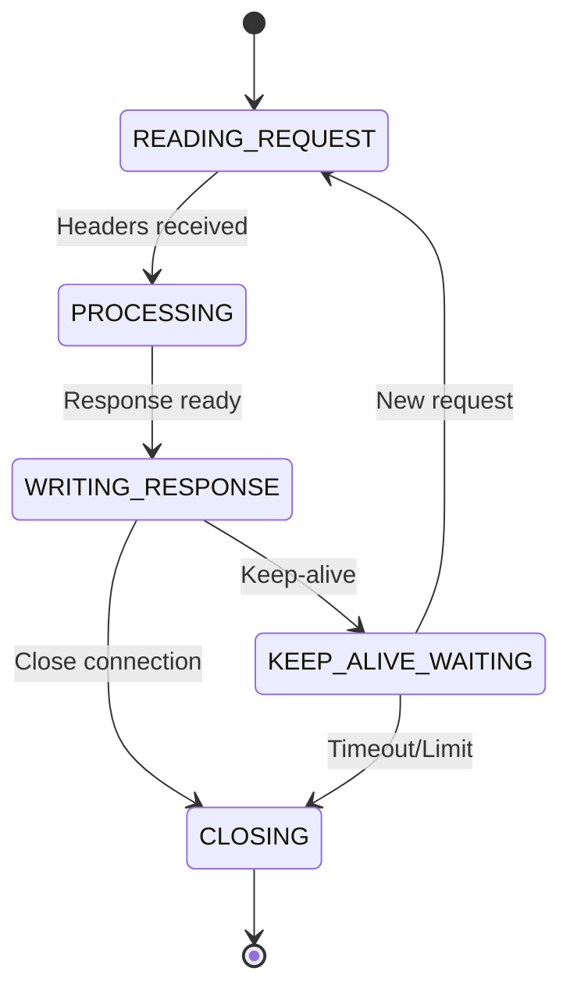

# Async HTTP Server (C++17)

A high-performance asynchronous HTTP server built with **Reactor + Thread Pool** architecture, implemented in native C++17. Supports 10K+ concurrent connections with full HTTP/1.1 protocol implementation.

[](https://cmake.org/)
[](https://en.cppreference.com/w/cpp/17)
[](https://docs.microsoft.com/en-us/windows/wsl/)

## 📋 Table of Contents
- [Features](#-features)
- [Architecture](#-architecture)
- [Quick Start](#-quick-start)
- [Building](#-building)
- [Performance](#-performance)
- [Project Structure](#-project-structure)
- [HTTP Features](#-http-features)
- [Development](#-development)
- [Roadmap](#-roadmap)
- [Contributing](#-contributing)
- [License](#-license)

## Features

### **Architectural**
- **Reactor Pattern** based on Linux `epoll` (edge-triggered)
- **Thread Pool** for CPU-intensive tasks (HTTP parsing, business logic)
- **Zero-copy notifications** via pipe for inter-thread communication
- **Lock-free structures** for concurrent metadata access

### **Networking**
- Full **HTTP/1.1** support (keep-alive, pipeline, chunked encoding)
- **Connection management** with timeouts and request limits
- **Graceful shutdown** with active connection completion
- **Non-blocking I/O** at all processing stages


## Architecture

### High-Level Overview
```
┌─────────────────────────────────────────────────────┐
│                    Main Thread (Reactor)            │
│  ┌─────────────┐  ┌─────────────┐  ┌─────────────┐ │
│  │   epoll     │  │   pipe      │  │   timer     │ │
│  │   (I/O)     │◄─┤(notifications)│  │(timeouts)  │ │
│  └──────┬──────┘  └─────────────┘  └─────────────┘ │
│         │                                          │
│         ▼                                          │
│  ┌─────────────┐       ┌─────────────────────┐    │
│  │ Connection  │──────►│   Thread Pool       │    │
│  │   State     │       │  (Worker Threads)   │    │
│  │   Machine   │◄──────│  • HTTP Parsing     │    │
│  └─────────────┘       │  • Business Logic   │    │
│                        └─────────────────────┘    │
└─────────────────────────────────────────────────────┘
```

### Connection State Machine


## Quick Start

### Prerequisites
- **Linux** or **WSL 2** (Ubuntu 20.04+)
- **CMake 3.15+**
- **GCC 9+** or **Clang 10+**
- Git

### Install Dependencies (Ubuntu/WSL)
```bash
sudo apt update
sudo apt install -y build-essential cmake git
```

### Clone and Build
```bash
# Clone repository
git clone https://github.com/yourusername/async-http-server.git
cd async-http-server

# Create build directory
mkdir build && cd build

# Configure CMake
cmake .. -DCMAKE_BUILD_TYPE=Release

# Build project
make -j$(nproc)

# Run server
./server
```

Server will start on `localhost:8080`. Test it:
```bash
curl http://localhost:8080/
# Output: Processed in thread pool. Path: /
```

## Performance


## Project Structure
```
async-http-server/
├── CMakeLists.txt              # Main build file
├── README.md                   # Documentation
├── .gitignore                  # Git ignores
├── include/                    # Header files
│   ├── server.hpp             # Main server
│   ├── connection.hpp         # Connection class
│   ├── connection_map.hpp     # Thread-safe container
│   ├── reactor.hpp           # Reactor for notifications
│   └── thread_pool.hpp       # Thread pool
├── src/                       # Source code
│   ├── main.cpp              # Entry point
│   ├── server.cpp            # Server logic
│   ├── connection.cpp        # Connection management
│   ├── connection_map.cpp    # Container implementation
│   ├── reactor.cpp          # Reactor implementation
│   └── thread_pool.cpp      # Thread pool implementation

```

## HTTP Features

### Supported Methods
- ✅ `GET` - Retrieve resources
- ✅ `HEAD` - Resource headers
- ⏳ `POST` - Partial support
- ❌ `PUT`, `DELETE`, `PATCH` - In development

### HTTP/1.1 Headers
```http
# Supported headers
Connection: keep-alive
Keep-Alive: timeout=5, max=100
Content-Length: 123
Host: example.com
User-Agent: Custom-Client/1.0

# Example keep-alive request
GET /api/data HTTP/1.1
Host: localhost:8080
Connection: keep-alive
Keep-Alive: timeout=30, max=1000
```

### Keep-Alive Parameters
| Parameter | Default | Description |
|-----------|---------|-------------|
| `timeout` | 30 seconds | Time to wait for next request |
| `max` | 100 requests | Maximum requests per connection |
| `Connection` | keep-alive | Connection state management |

